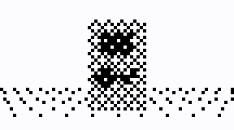
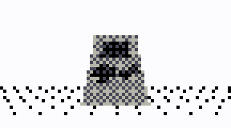

# thumby-misc
This repo contains a mirror of any useful scripts, tools, or snippets of code for the [Thumby](https://thumby.us/) that I've posted in the [official discord server](https://discord.gg/vzf3wQXVvm). Links are provided to all relevant discord messages.

It is recommended to use the code provided here rather than the original posts in discord, as attached files on discord cannot be edited to fix any bugs.

### 3Dtest


*Performance is much better on real hardware.*

A test of polygon drawing for a game I was intending to make, but put on the back burner in favour of other projects. I may return and finish the game at some point in the future.

Use the D-pad and A/B to move around.

*[(Original video)](https://discord.com/channels/898292107289190461/898292174410612787/943969254036893776) [(Code)](https://discord.com/channels/898292107289190461/898292174410612787/945428253257105409)*

### 3Dtest_gray


*Performance is much better on real hardware.*

Same as 3Dtest, but in grayscale using the unofficial [Thumby Grayscale library](https://github.com/Timendus/thumby-grayscale).

Same controls, but with the addition that pressing A and B at the same time quits back to the menu.

*[(Code)](https://discord.com/channels/898292107289190461/996871099499425873/1043773174464135298)*

### Clouds


*Performance is much better on real hardware.*

A rising clouds effect, heavily inspired by the opening of the Commodore 64 demo *[Uncensored](https://www.youtube.com/watch?v=9LFD4SzW3e0)* created by the group *Booze Design*.

Uses the same dither code and grayscale library as *3Dtest_gray*.

Press B to toggle outlines, and A to quit.

*[(Code and original videos)](https://discord.com/channels/898292107289190461/898292174410612787/1143082064871170049)*

### audiotest
A simple music player written shortly after audio support was added to the emulator. You can probably guess what song it plays.

A character-to-note conversion table is included for anyone to tinker with, though for actually adding music to games I would highly advise using the much more capable [Polysynth](https://github.com/transistortester/thumby-polysynth) instead.

*[(Code)](https://discord.com/channels/898292107289190461/898292174410612787/949009396745248788)* *[(Conversion table)](https://discord.com/channels/898292107289190461/898292174410612787/978056752052465684)*

### screenrec/vdfplay
A screen recorder and video player that runs on real hardware. Uses lightweight compression to achieve good performance and save space. Inspired by my logo format at the start of [PSdemo](https://github.com/transistortester/thumby-polysynth/tree/main/PSdemo), and used to record the arcade video of PSdemo as it does not run under emulation. `screenrec` contains both the recorder and player, whereas `vdfplay` is a cut-down version that can only play videos.

#### Recording a video
To use, import `screenrec` as you would any other library:
```py
from sys import path as syspath
syspath.insert(0, "/Games/(your game folder)")
import screenrec
```

Start a recording by calling `screenrec.init()` with a file and desired framerate:
```py
file = open("recording.vdf", "wb")
screenrec.init(file, fps=30)
```
*Note: If `fps` is `None` or not specified, frames will be saved in real time rather than at a fixed framerate*

Once initialized, you can save frames by calling `screenrec.addframe()`. Typically you want to do this anywhere there's a `thumby.display.update()`.

Finally, you can finish saving a recording by calling `screenrec.finish()`.

#### Playing back a video
Import `screenrec` as above. To play a video, simply open the video file and call `screenrec.play()` with it:
```py
with open("recording.vdf", "rb") as file:
    screenrec.play(file)
```
Pressing A will stop playback at any point.

*[(Code)](https://discord.com/channels/898292107289190461/898292174410612787/1016541133234520135) [(How to use)](https://discord.com/channels/898292107289190461/898292174410612787/1079125786113622188) [(vdfplay)](https://discord.com/channels/898292107289190461/898292174410612787/1079139408197980272)*

### printmem
A simple helper function to print memory usage.

*[(Code)](https://discord.com/channels/898292107289190461/898292174410612787/979006475211006043)*

### screenshot
The simplest possible way to take and display a screenshot, in response to someone asking if `screenrec` could do that (it technically can, but it's overkill).

*[(Code)](https://discord.com/channels/898292107289190461/898292174410612787/1016793119745904731)*
